# 02 — UML and Design Decisions

## 1. Architectural overview

The proposed system uses a layered desktop architecture:

```text
Vista (Swing)
    ↓ user events / view models
Controlador
    ↓ use cases
Servicio
    ↓ domain rules and transactions
DAO interfaces
    ↓ JDBC implementations
SQLite database
```

DTOs cross layer boundaries when a use case does not need to expose a full mutable domain object. Domain classes represent clinic concepts and enforce basic invariants. Services coordinate multi-entity business rules. Controllers translate Swing events into service calls and convert exceptions into user-facing messages.

## 2. UML class diagram

The diagram uses Spanish identifiers for application classes, methods, attributes, states, and packages, while explanatory notes remain in English.

```mermaid
classDiagram
    direction LR

    namespace modelo {
        class Persona {
            <<abstract>>
            -Long id
            -String nombre
            -String apellido
            -String telefono
            -String correoElectronico
            -boolean activo
            +getNombreCompleto() String
            +validar() void
            +getTipoPersona() String*
        }

        class Cliente {
            -String dni
            -String direccion
            -LocalDateTime fechaRegistro
            +getTipoPersona() String
            +validar() void
        }

        class Veterinario {
            -String matricula
            -String especialidad
            +getTipoPersona() String
            +validar() void
        }

        class Gato {
            -Long idGato
            -Long idCliente
            -String nombre
            -LocalDate fechaNacimiento
            -SexoGato sexo
            -String raza
            -String color
            -BigDecimal pesoActual
            -String numeroMicrochip
            -boolean esterilizado
            -String alergias
            -String observaciones
            -boolean activo
            +calcularEdadAproximada() Period
            +validar() void
        }

        class Turno {
            -Long idTurno
            -Long idGato
            -Long idVeterinario
            -LocalDateTime fechaHora
            -String motivo
            -EstadoTurno estado
            -LocalDateTime fechaCreacion
            -LocalDateTime fechaCierre
            -String motivoCancelacion
            -String observaciones
            +puedeTransicionarA(EstadoTurno) boolean
            +cambiarEstado(EstadoTurno) void
            +estaAbierto() boolean
        }

        class Atencion {
            -Long idAtencion
            -Long idTurno
            -String diagnostico
            -BigDecimal pesoRegistrado
            -BigDecimal temperatura
            -String observacionesClinicas
            -String indicaciones
            -LocalDateTime fechaRegistro
            -List~DetalleTratamiento~ tratamientos
            +agregarTratamiento(DetalleTratamiento) void
            +validar() void
        }

        class Tratamiento {
            -Long idTratamiento
            -String nombre
            -String descripcion
            -BigDecimal precioReferencia
            -boolean activo
            +validar() void
        }

        class DetalleTratamiento {
            -Long idTratamiento
            -String dosis
            -String frecuencia
            -Integer duracionDias
            -String observaciones
        }

        class EstadoTurno {
            <<enumeration>>
            PROGRAMADO
            CONFIRMADO
            COMPLETADO
            CANCELADO
        }

        class SexoGato {
            <<enumeration>>
            MACHO
            HEMBRA
            DESCONOCIDO
        }
    }

    Persona <|-- Cliente
    Persona <|-- Veterinario
    Cliente "1" --> "0..*" Gato : posee
    Gato "1" --> "0..*" Turno : recibe
    Veterinario "1" --> "0..*" Turno : atiende
    Turno "1" --> "0..1" Atencion : produce
    Atencion "1" o-- "0..*" DetalleTratamiento : contiene
    DetalleTratamiento "*" --> "1" Tratamiento : referencia
    Turno --> EstadoTurno
    Gato --> SexoGato

    namespace dao {
        class DaoCrud~T,ID~ {
            <<interface>>
            +crear(T entidad) T
            +buscarPorId(ID id) Optional~T~
            +listarTodos() List~T~
            +actualizar(T entidad) boolean
            +eliminar(ID id) boolean
        }

        class ClienteDao {
            <<interface>>
            +buscarPorDni(String dni) Optional~Cliente~
            +buscarPorTexto(String texto) List~Cliente~
        }

        class GatoDao {
            <<interface>>
            +listarPorCliente(Long idCliente) List~Gato~
            +buscarPorMicrochip(String numero) Optional~Gato~
        }

        class TurnoDao {
            <<interface>>
            +listarPorFecha(LocalDate fecha) List~Turno~
            +existeSuperposicion(Long idVeterinario, LocalDateTime fechaHora, Long idExcluir) boolean
            +actualizarEstado(Long idTurno, EstadoTurno estado, LocalDateTime fechaCierre, String motivo) boolean
        }

        class AtencionDao {
            <<interface>>
            +buscarPorTurno(Long idTurno) Optional~Atencion~
            +listarHistoriaClinica(Long idGato) List~HistoriaClinicaDto~
        }

        class TratamientoDao {
            <<interface>>
            +listarActivos() List~Tratamiento~
        }

        class ClienteDaoSqlite
        class GatoDaoSqlite
        class VeterinarioDaoSqlite
        class TurnoDaoSqlite
        class AtencionDaoSqlite
        class TratamientoDaoSqlite
        class ReporteDaoSqlite
    }

    DaoCrud~Cliente,Long~ <|-- ClienteDao
    DaoCrud~Gato,Long~ <|-- GatoDao
    DaoCrud~Turno,Long~ <|-- TurnoDao
    DaoCrud~Atencion,Long~ <|-- AtencionDao
    DaoCrud~Tratamiento,Long~ <|-- TratamientoDao
    ClienteDao <|.. ClienteDaoSqlite
    GatoDao <|.. GatoDaoSqlite
    TurnoDao <|.. TurnoDaoSqlite
    AtencionDao <|.. AtencionDaoSqlite
    TratamientoDao <|.. TratamientoDaoSqlite

    namespace dto {
        class ClienteFormularioDto {
            +Long idCliente
            +String nombre
            +String apellido
            +String dni
            +String telefono
            +String correoElectronico
            +String direccion
        }

        class GatoFormularioDto {
            +Long idGato
            +Long idCliente
            +String nombre
            +LocalDate fechaNacimiento
            +String sexo
            +String raza
            +BigDecimal pesoActual
        }

        class TurnoFormularioDto {
            +Long idGato
            +Long idVeterinario
            +LocalDateTime fechaHora
            +String motivo
            +String observaciones
        }

        class CierreAtencionDto {
            +Long idTurno
            +String diagnostico
            +BigDecimal pesoRegistrado
            +BigDecimal temperatura
            +String indicaciones
            +List~DetalleTratamientoDto~ tratamientos
        }

        class ReporteTratamientoFrecuenteDto {
            +Long idTratamiento
            +String nombreTratamiento
            +long cantidadAplicaciones
            +double porcentaje
        }

        class ReporteTurnosMensualesDto {
            +YearMonth mes
            +long programados
            +long confirmados
            +long completados
            +long cancelados
        }

        class HistoriaClinicaDto {
            +LocalDateTime fechaHora
            +String veterinario
            +String diagnostico
            +BigDecimal pesoRegistrado
            +String tratamientos
        }
    }

    namespace servicio {
        class ServicioCliente {
            -ClienteDao clienteDao
            +crear(ClienteFormularioDto dto) Cliente
            +actualizar(ClienteFormularioDto dto) boolean
            +eliminar(Long idCliente) boolean
            +buscar(String texto) List~Cliente~
        }

        class ServicioGato {
            -GatoDao gatoDao
            -ClienteDao clienteDao
            +crear(GatoFormularioDto dto) Gato
            +actualizar(GatoFormularioDto dto) boolean
            +eliminar(Long idGato) boolean
            +listarPorCliente(Long idCliente) List~Gato~
        }

        class ServicioTurno {
            -TurnoDao turnoDao
            -GatoDao gatoDao
            -VeterinarioDao veterinarioDao
            -AtencionDao atencionDao
            +programar(TurnoFormularioDto dto) Turno
            +confirmar(Long idTurno) void
            +cancelar(Long idTurno, String motivo) void
            +completar(CierreAtencionDto dto) void
        }

        class ServicioReporte {
            -Map~TipoReporte,EstrategiaReporte~ estrategias
            +generar(TipoReporte tipo, FiltroReporteDto filtro) List
        }
    }

    ServicioCliente --> ClienteDao
    ServicioGato --> GatoDao
    ServicioGato --> ClienteDao
    ServicioTurno --> TurnoDao
    ServicioTurno --> AtencionDao
    ServicioReporte --> ReporteDaoSqlite

    namespace estrategia {
        class EstrategiaReporte~R~ {
            <<interface>>
            +generar(FiltroReporteDto filtro) List~R~
            +getTipo() TipoReporte
        }

        class EstrategiaTratamientosFrecuentes
        class EstrategiaTurnosMensuales
        class EstrategiaProductividadVeterinario
    }

    EstrategiaReporte~ReporteTratamientoFrecuenteDto~ <|.. EstrategiaTratamientosFrecuentes
    EstrategiaReporte~ReporteTurnosMensualesDto~ <|.. EstrategiaTurnosMensuales
    EstrategiaReporte <|.. EstrategiaProductividadVeterinario
    ServicioReporte o-- EstrategiaReporte

    namespace util {
        class ConexionBaseDatos {
            <<Singleton>>
            -static ConexionBaseDatos instancia
            -String url
            -ConexionBaseDatos()
            +getInstancia() ConexionBaseDatos
            +obtenerConexion() Connection
            +ejecutarEnTransaccion(TrabajoTransaccional~R~ trabajo) R
        }

        class TrabajoTransaccional~R~ {
            <<functional interface>>
            +ejecutar(Connection conexion) R
        }

        class ColeccionesUtil {
            +filtrar~T~(List~T~ origen, Predicate~T~ criterio) List~T~
            +indexarPor~T,K~(Collection~T~ elementos, Function~T,K~ clave) Map~K,T~
        }
    }

    ConexionBaseDatos --> TrabajoTransaccional
    ClienteDaoSqlite --> ConexionBaseDatos
    GatoDaoSqlite --> ConexionBaseDatos
    TurnoDaoSqlite --> ConexionBaseDatos
    AtencionDaoSqlite --> ConexionBaseDatos
    TratamientoDaoSqlite --> ConexionBaseDatos
    ReporteDaoSqlite --> ConexionBaseDatos

    namespace controlador {
        class ControladorCliente
        class ControladorGato
        class ControladorTurno
        class ControladorReporte
    }

    namespace vista {
        class VentanaPrincipal {
            <<JFrame>>
            -JMenuBar barraMenu
            -CardLayout contenido
            +mostrarPanel(String nombre) void
            +mostrarError(String mensaje) void
        }

        class PanelClientes
        class PanelGatos
        class PanelTurnos
        class PanelAtenciones
        class PanelReportes
    }

    VentanaPrincipal o-- PanelClientes
    VentanaPrincipal o-- PanelGatos
    VentanaPrincipal o-- PanelTurnos
    VentanaPrincipal o-- PanelAtenciones
    VentanaPrincipal o-- PanelReportes
    ControladorCliente --> ServicioCliente
    ControladorGato --> ServicioGato
    ControladorTurno --> ServicioTurno
    ControladorReporte --> ServicioReporte
    PanelClientes --> ControladorCliente
    PanelGatos --> ControladorGato
    PanelTurnos --> ControladorTurno
    PanelAtenciones --> ControladorTurno
    PanelReportes --> ControladorReporte

    namespace excepcion {
        class ClinicaException
        class ValidacionException
        class EntidadNoEncontradaException
        class TurnoNoDisponibleException
        class TransicionTurnoInvalidaException
        class PersistenciaException
    }

    RuntimeException <|-- ClinicaException
    ClinicaException <|-- ValidacionException
    ClinicaException <|-- EntidadNoEncontradaException
    ClinicaException <|-- TurnoNoDisponibleException
    ClinicaException <|-- TransicionTurnoInvalidaException
    ClinicaException <|-- PersistenciaException
    ServicioTurno ..> TurnoNoDisponibleException
    ServicioTurno ..> TransicionTurnoInvalidaException
    ClienteDaoSqlite ..> PersistenciaException
```



## 3. Design decisions and justification

### 3.1 Layered architecture

The Swing UI must not contain SQL or complex business rules. Separating the application into view, controller, service, DAO, and model layers improves testability and makes each class easier to explain during an oral defence.

- Views handle visual state and user interaction.
- Controllers receive events and coordinate presentation logic.
- Services enforce business rules and transaction boundaries.
- DAOs contain SQL and JDBC mapping.
- Domain models represent clinic concepts.
- DTOs transfer use-case-specific data.

This separation also avoids a common anti-pattern in student projects: a large `JFrame` containing form validation, SQL strings, and business-state changes in the same class.

### 3.2 Spanish application design

Class names, method names, variables, database identifiers, enum values, and UI labels are in Spanish to satisfy the application-language requirement. Documentation remains in English to satisfy the deliverable-language requirement.

### 3.3 Abstract class and inheritance

`Persona` is abstract because the system never creates a generic person. It captures shared properties and behaviour for `Cliente` and `Veterinario`:

- `nombre`
- `apellido`
- `telefono`
- `correoElectronico`
- `activo`
- `getNombreCompleto()`
- `validar()`
- abstract `getTipoPersona()`

`Cliente` and `Veterinario` inherit these members and add their own fields. This is meaningful inheritance because both are people with shared identity and contact behaviour, not inheritance added only to satisfy the rubric.

### 3.4 Polymorphism

Polymorphism appears in two places:

1. `Cliente` and `Veterinario` can be processed as `Persona` objects. For example, a utility can display contact summaries from `List<Persona>` and call the overridden `getTipoPersona()` method.
2. Report algorithms implement `EstrategiaReporte<R>`. `ServicioReporte` invokes `generar()` without depending on the concrete report class.

### 3.5 Encapsulation

Fields remain private. State changes occur through methods that validate invariants. `Turno.cambiarEstado(...)` prevents arbitrary assignment to terminal states. DAOs map database rows into objects but do not bypass domain validation for new user input.

## 4. Singleton pattern

### Class

`ConexionBaseDatos`

### Responsibility

- Hold the JDBC URL.
- Create configured connections.
- Ensure `PRAGMA foreign_keys = ON` for every connection.
- Centralise timeout and transaction settings.
- Provide a reusable transaction helper.

### Important clarification

The Singleton represents one connection manager, not necessarily one permanently open `Connection`. A desktop SQLite application is safer when each DAO operation obtains a short-lived connection through try-with-resources. The Singleton controls configuration and connection creation while avoiding a fragile global open connection.

### Suggested implementation rules

- Private constructor.
- `private static volatile ConexionBaseDatos instancia`.
- Thread-safe lazy initialisation or an eager static final instance.
- `getInstancia()` returns the unique manager.
- `obtenerConexion()` calls `DriverManager.getConnection(url)`.
- Execute `PRAGMA foreign_keys = ON` after opening a connection.
- Wrap `SQLException` in `PersistenciaException` with the original cause.

## 5. DAO pattern

### Purpose

DAO isolates persistence logic from business and UI code.

### Generic base contract

```java
public interface DaoCrud<T, ID> {
    T crear(T entidad);
    Optional<T> buscarPorId(ID id);
    List<T> listarTodos();
    boolean actualizar(T entidad);
    boolean eliminar(ID id);
}
```

### Specific contracts

- `ClienteDao extends DaoCrud<Cliente, Long>`
- `GatoDao extends DaoCrud<Gato, Long>`
- `VeterinarioDao extends DaoCrud<Veterinario, Long>`
- `TurnoDao extends DaoCrud<Turno, Long>`
- `AtencionDao extends DaoCrud<Atencion, Long>`
- `TratamientoDao extends DaoCrud<Tratamiento, Long>`

Specific methods belong in the specialised interfaces, such as:

- `ClienteDao.buscarPorDni(...)`
- `GatoDao.listarPorCliente(...)`
- `TurnoDao.existeSuperposicion(...)`
- `AtencionDao.listarHistoriaClinica(...)`

Concrete classes such as `ClienteDaoSqlite` implement SQL using `PreparedStatement`, never string concatenation with user input.

## 6. DTO pattern

### Purpose

DTOs prevent Swing forms and report screens from depending on persistence entities. They also make validation and table rendering clearer.

### Planned DTO categories

#### Form DTOs

- `ClienteFormularioDto`
- `GatoFormularioDto`
- `TurnoFormularioDto`
- `CierreAtencionDto`
- `DetalleTratamientoDto`

These contain raw or normalised form values and are passed from controllers to services.

#### Report DTOs

- `ReporteTratamientoFrecuenteDto`
- `ReporteTurnosMensualesDto`
- `ReporteProductividadVeterinarioDto`
- `HistoriaClinicaDto`

These represent joined and aggregated query results that do not correspond to one database table.

### Benefits

- Reduced coupling.
- Safer UI updates.
- Clear validation boundaries.
- Easier report-table models.
- No accidental persistence caused by modifying a displayed entity.

## 7. Additional pattern: Strategy

### Reason for choosing Strategy

Reports have the same high-level operation but different SQL, return types, columns, and validation rules. Strategy allows the selected report to change at runtime without large `switch` blocks inside the UI.

### Contract

```java
public interface EstrategiaReporte<R> {
    TipoReporte getTipo();
    List<R> generar(FiltroReporteDto filtro);
}
```

### Concrete strategies

- `EstrategiaTratamientosFrecuentes`
- `EstrategiaTurnosMensuales`
- `EstrategiaProductividadVeterinario`
- `EstrategiaPacientesPorMes`
- `EstrategiaHistoriaClinica`

### Selection

`ServicioReporte` stores the strategies in:

```java
Map<TipoReporte, EstrategiaReporte<?>> estrategias;
```

At startup, the service receives all strategy instances and indexes them by `TipoReporte`. The selected UI option determines which strategy is called.

### Polymorphic behaviour

The service calls the shared `generar(...)` method. Each strategy validates its filter and delegates to `ReporteDaoSqlite` or a specialised report DAO method.

## 8. Exception design

### 8.1 Base exception

`ClinicaException extends RuntimeException`

This is the base for expected application-level failures. Controllers can catch it and show its message without exposing database stack traces to the user.

### 8.2 Custom business exceptions

#### `TransicionTurnoInvalidaException`

Thrown when a state change violates the appointment lifecycle.

Examples:

- `COMPLETADO` → `PROGRAMADO`
- `CANCELADO` → `COMPLETADO`
- Completing a `Turno` that already has an `Atencion`

Suggested message:

```text
No se puede cambiar el turno 42 de CANCELADO a COMPLETADO.
```

#### `TurnoNoDisponibleException`

Thrown when a veterinarian already has another open appointment in the same slot or when the selected time violates scheduling rules.

#### `EntidadNoEncontradaException`

Thrown when a referenced `Cliente`, `Gato`, `Veterinario`, or `Turno` does not exist.

#### `ValidacionException`

Thrown for invalid form or domain data, such as an empty cat name, negative weight, or missing cancellation reason.

### 8.3 Persistence exception

`PersistenciaException` wraps `SQLException` and adds operation context. The original exception must remain as the cause for logging and debugging.

### 8.4 Catching policy

- DAO: catch `SQLException`, throw `PersistenciaException`.
- Service: allow business exceptions to propagate; roll back transactions on any failure.
- Controller: catch `ClinicaException`, log details, show a Spanish user message.
- Main application: catch fatal initialisation exceptions and show a blocking error dialog.

Do not use empty catch blocks. Do not show raw SQL errors directly to clinic staff.

## 9. Generic collections and generic methods

### Collections

Examples include:

- `List<Cliente>` for search results.
- `List<Gato>` for a selected client.
- `ArrayList<DetalleTratamiento>` while building an attention record.
- `Map<EstadoTurno, Long>` for appointment-state totals.
- `Map<TipoReporte, EstrategiaReporte<?>>` for report strategies.
- `Set<Long>` to avoid duplicate treatment identifiers.

### Required custom generic method

```java
public static <T> List<T> filtrar(
        List<T> origen,
        Predicate<? super T> criterio) {
    List<T> resultado = new ArrayList<>();
    for (T elemento : origen) {
        if (criterio.test(elemento)) {
            resultado.add(elemento);
        }
    }
    return resultado;
}
```

Example use:

```java
List<Gato> gatosActivos = ColeccionesUtil.filtrar(
    gatos,
    Gato::isActivo
);
```

A second useful generic method is:

```java
public static <T, K> Map<K, T> indexarPor(
        Collection<T> elementos,
        Function<? super T, ? extends K> extractorClave)
```

This can index report strategies by `TipoReporte` or entities by identifier.

## 10. Transaction design

Completing an appointment changes multiple tables and must be atomic:

1. Validate appointment state.
2. Insert `atenciones`.
3. Insert zero or more `atencion_tratamientos` rows.
4. Update `turnos.estado` to `COMPLETADO`.
5. Store `turnos.fecha_cierre`.
6. Commit.

If any step fails, roll back everything.

Suggested generic transaction helper:

```java
public <R> R ejecutarEnTransaccion(TrabajoTransaccional<R> trabajo) {
    try (Connection conexion = obtenerConexion()) {
        boolean autoCommitOriginal = conexion.getAutoCommit();
        conexion.setAutoCommit(false);
        try {
            R resultado = trabajo.ejecutar(conexion);
            conexion.commit();
            return resultado;
        } catch (Exception ex) {
            conexion.rollback();
            throw ex;
        } finally {
            conexion.setAutoCommit(autoCommitOriginal);
        }
    } catch (SQLException ex) {
        throw new PersistenciaException("Error en la transacción", ex);
    }
}
```

DAO implementations used inside this helper need overloads that accept an existing `Connection`, so every statement participates in the same transaction.

## 11. Validation rules

### `Cliente`

- `nombre` and `apellido` are required.
- `dni` is required and unique.
- Email is optional but must be valid when present.
- Telephone is required.

### `Gato`

- `idCliente` must reference an active client.
- `nombre` is required.
- `pesoActual` cannot be negative.
- `fechaNacimiento` cannot be in the future.
- `numeroMicrochip` is optional but unique when present.

### `Turno`

- Cat and veterinarian must exist and be active.
- Date and time cannot be in the past when creating the appointment.
- A veterinarian cannot have two open appointments in the same slot.
- `motivo` is required.
- Terminal-state appointments cannot be edited except for read-only notes permitted by policy.

### `Atencion`

- Only an open appointment can be completed.
- `diagnostico` is required.
- Weight and temperature must be within configurable plausible ranges.
- Treatment identifiers must exist and be active.

## 12. Security and data-integrity decisions

Although this is a local academic project, it should still use sound practices:

- Prepared statements for every user-supplied value.
- Foreign keys enabled for each SQLite connection.
- Unique constraints for DNI, veterinarian licence, and microchip.
- `CHECK` constraints for state values, sex values, booleans, and non-negative amounts.
- Transactions for multi-table writes.
- Logical deactivation where historical records must be preserved.
- Confirmation dialogs before destructive actions.
- No SQL or stack traces displayed in normal UI messages.
